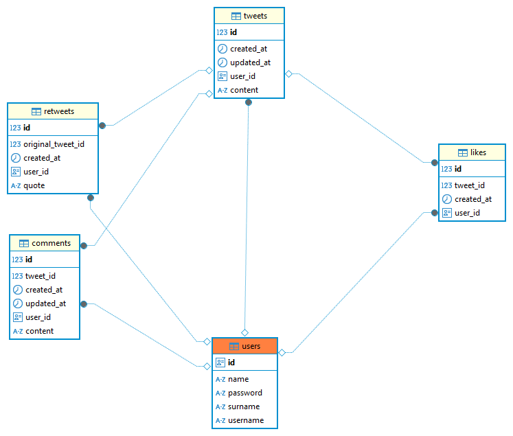

# Twitter Lite API

## 📝 Overview
A Twitter clone backend API built with Spring Boot, implementing core Twitter functionalities with a focus on clean architecture and best practices.

### 🛠️ Tech Stack
- **Java** 21
- **Spring Boot** 3.2.2
- **PostgreSQL** Database
- **Spring Security** with JWT Authentication
- **OpenAPI/Swagger** 2.3.0 Documentation
- **JUnit** & **Mockito** Testing
- **Maven** Build Tool
- **YAML** Configuration
- **Lombok** for boilerplate reduction
- **JWT** (jjwt 0.11.5) for token-based authentication
- **BCrypt** for password encryption

## 🏗️ Architecture


### 📚 Key Features
- **🔐 Authentication**
    - JWT-based authentication
    - Register & Login functionality
    - Password encryption with BCrypt

- **📱 Core Twitter Features**
    - ✏️ Tweet CRUD operations
    - 💬 Comments
    - ❤️ Likes
    - 🔄 Retweets
    - 👤 User profiles

## 🚀 Getting Started

### Prerequisites
- Java 21
- PostgreSQL
- Maven 3.9+

## 🔍 API Documentation

### 👤 User Endpoints
#### Authentication
- `POST /users/register` - Register new user
- `POST /users/login` - Login user
- `GET /users/{username}` - Get user profile

### 📝 Tweet Endpoints
#### Tweet Operations
- `POST /tweet` - Create new tweet
- `GET /tweet/findById` - Get tweet by ID
- `GET /tweet/findByUserId` - Get user's tweets
- `GET /tweet/my-tweets` - Get current user's tweets
- `PUT /tweet/{id}` - Update tweet
- `DELETE /tweet/{id}` - Delete tweet

### 💬 Comment Endpoints
#### Comment Operations
- `POST /comment` - Add comment to tweet
- `PUT /comment/{id}` - Update comment
- `DELETE /comment/{id}` - Delete comment
- `GET /comment/byTweetId/{tweetId}` - Get all comments of a tweet

### ❤️ Like Endpoints
#### Like Operations
- `POST /like` - Like or unlike tweet (toggle)

### 🔄 Retweet Endpoints
#### Retweet Operations
- `POST /retweet` - Create retweet with quote
- `DELETE /retweet/{id}` - Delete retweet
- `GET /retweet/findByUserId` - Get user's retweets
- `GET /retweet/my-retweets` - Get current user's retweets

### 🔒 Authentication

#### Public Endpoints (No Authentication Required)
- Authentication:
    - `POST /users/register` - Register new user
    - `POST /users/login` - Login user

- Read Operations:
    - `GET /tweet/**` - All tweet read operations
    - `GET /comment/**` - All comment read operations
    - `GET /retweet/**` - All retweet read operations

#### Protected Endpoints (Authentication Required)
- Tweet Operations:
    - `POST /tweet` - Create tweet
    - `PUT /tweet/**` - Update tweet
    - `DELETE /tweet/**` - Delete tweet

- Comment Operations:
    - `POST /comment` - Create comment
    - `PUT /comment/**` - Update comment
    - `DELETE /comment/**` - Delete comment

- Like Operations:
    - `POST /like` - Like/unlike tweet

- Retweet Operations:
    - `POST /retweet` - Create retweet
    - `DELETE /retweet/**` - Delete retweet

#### Authentication Header
For protected endpoints, add the JWT token to the Authorization header:

```
Authorization: Bearer <JWT_TOKEN>
```

## 🧪 Testing
The project includes comprehensive unit tests covering:

### 🔍 Controller Layer Tests
- Request validation
- Response structure validation
- Authentication checks
- Error handling scenarios

### 🛠️ Testing Tools
- JUnit 5
- Mockito
- MockMvc for endpoint testing
- Custom TestSecurityConfig for authentication simulation

## 🔒 Security Features
- JWT Authentication
- Password Encryption
- Input Validation
- Global Exception Handling

## 🎯 Project Structure
```
src/
├── main/
│   ├── java/
│   │   └── com/example/twitter/
│   │       ├── config/
│   │       ├── controller/
│   │       ├── dto/
│   │       ├── entity/
│   │       ├── repository/
│   │       ├── service/
│   │       └── util/
│   └── resources/
└── test/
    └── java/
```

## 🔗 Related Projects
- [Frontend Repository](https://github.com/melih-vardar/twitter-lite)

---
